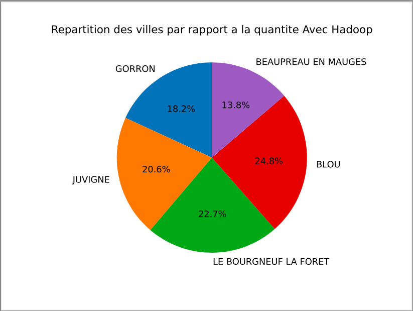
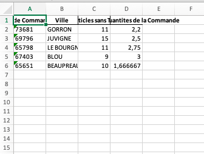
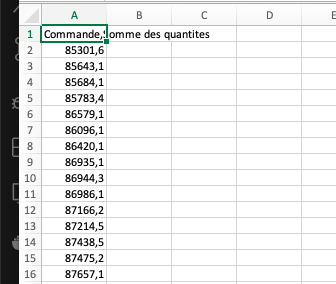
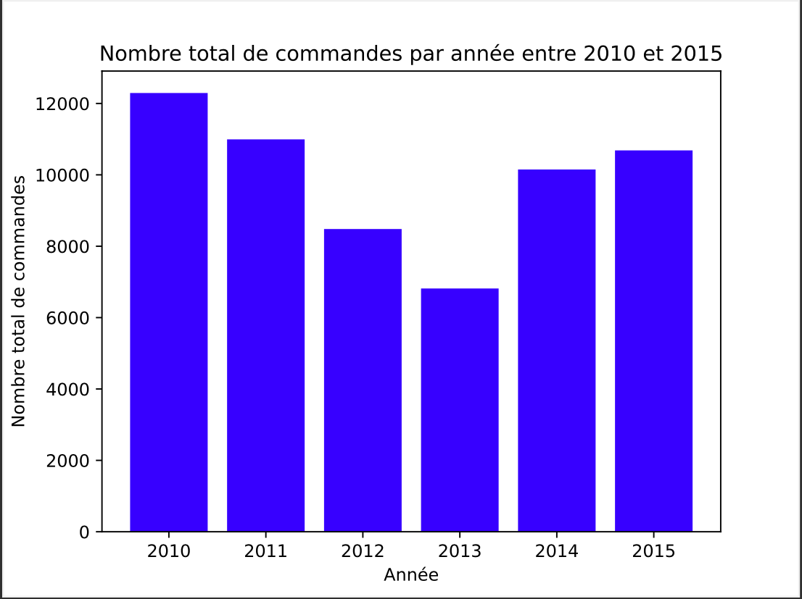
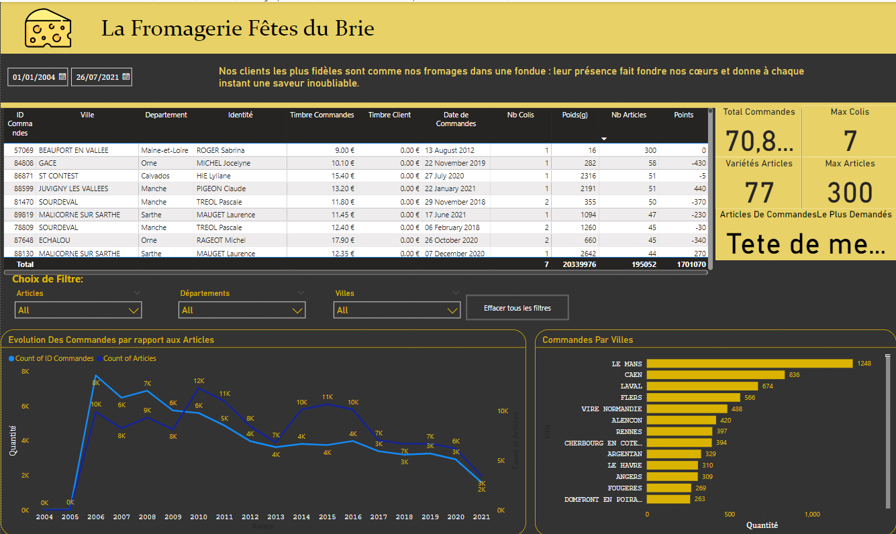

# Bienvenue sur le Projet-Big-Data 🚀

Groupe : Christ / Fatima / Christopher / Dorian

## Description du projet

Ce projet a été réalisé dans le cadre du cours de Data Sciences et utilise Hadoop, Python et Power BI pour analyser et traiter des données provenant d'une fromagerie. Le projet est divisé en plusieurs lots, chacun ayant des objectifs spécifiques.

Les scripts Python sont commentés avec des docstrings expliquant leurs objectifs et leur utilisation. L'utilisateur peut lancer les scripts directement depuis un IDE compatible Python ou depuis Hadoop (nécessaire pour HBase - Lot 3).


## 🔥 Modules Python et leurs fonctionnalités

- **Sys** :

Fournit des fonctions pour manipuler l'environnement d'exécution Python.
Utilisation : Récupérer les arguments de la ligne de commande (sys.argv), quitter le programme (sys.exit()).

- **Panda** :

Bibliothèque pour la manipulation et l'analyse de données.
Utilisation : Lire des fichiers CSV, nettoyer et transformer des données, calculer des statistiques descriptives.

- **datetime**:

Module pour travailler avec des dates et des heures.
Utilisation : Calculer des différences de temps, formater et manipuler des dates.

- **decimal** :

Fournit un type de données pour les nombres décimaux avec une précision élevée.
Utilisation : Calculs arithmétiques précis, contrôle de la précision des calculs.

- **matplotlib.pyplot** :

Bibliothèque pour créer des graphiques en 2D.
Utilisation : Créer des graphiques linéaires, à barres, à secteurs (camembert), histogrammes, etc.

- **random** :

Module pour générer des nombres aléatoires.
Utilisation : Générer des nombres aléatoires, choisir des éléments aléatoires dans une liste, mélanger des séquences.

- **csv** :

Module pour lire et écrire des fichiers CSV.
Utilisation : Lire des données depuis des fichiers CSV, écrire des résultats dans des fichiers CSV.

- **happybase** :

Client Python pour Apache HBase, une base de données distribuée.
Utilisation : Se connecter à HBase, effectuer des opérations CRUD sur les tables HBase.

## 📚 Prérequis

Avant de démarrer, assurez-vous d'avoir installé Python 3.5 ou une version stable recommandée.


## 🚀 Pour commencer

Cloner et installer, aussi simple que ça :

```bash
git clone chttps://git@github.com:Diginamic-M09-Gr3/32123BC6-Big-Data.git
cd projet-hadoop-big-data
pip install pandas numpy matplotlib happybase
```


## Instructions pour l'exécution

Pour Hadoop

1. Exécution de l'environnement Hadoop et modification ou configuration des dossiers appropriés.

2. Lancement d'un job MapReduce avec la commande (exemple pour le lot 1) :

```bash
hadoop jar hadoop-streaming-2.7.2.jar -file mapper_lot1.py -mapper "python3 mapper_lot1.py" -file reducer_lot1.py -reducer "python3 reducer_lot1.py" -input input/dataw_fro03.csv -output output/output_lot1_exo1
```

Pour HBase

1. Filtrage et Analyse des Données

   Exécution des scripts de filtrage et d'analyse pour chaque lot :

   ## LOT 1
```bash
   Lot_1/start_lot1.sh
   ```

   ## LOT 2
```bash
   Lot_2/start_lot2.sh
   ```

2. Interrogation de HBase pour les requêtes du Lot 3


```bash
    python Lot_3/hbase_lot3.py
```


## Vérification des résultats dans le répertoire de sortie approprié.


Rendu du projet

## LOT 1

Objectifs réalisés :

Filtrage des données entre 2006 et 2010 pour les départements 53, 61 et 28.
 ```bash
   hadoop jar hadoop-streaming-2.7.2.jar -file mapper lot1.py -mapper ”python3 mapper lot1.py” -input input/dataw fro03.csv -output output/output lot1 exo1
   ```

Extraction des 100 meilleures commandes en termes de quantité totale et de nombre de « timbrecde ».

```bash
hadoop jar hadoop-streaming-2.7.2.jar -file mapper lot1.py -mapper ”python3 mapper lot1.py” -file reducer lot1.py -reducer ”python3 reducer lot1.py” -input input/dataw fro03.csv -output output/output lot1 exo1
```
   
Exportation des résultats dans un fichier Excel
 
Resultats_lot1.xlsx:     


## LOT 2

Objectifs réalisés :

Filtrage des données entre 2011 et 2016 pour les départements 22, 49 et 53.
```bash
hadoop jar hadoop-streaming-2.7.2.jar -file mapper_lot2.py -mapper "python3 mapper_lot2.py" -file reducer_lot2.py -reducer "python3 reducer_lot2.py" -input input/dataw_fro03.csv -output output/output_lot2_exo1
```
Fichiers produits :

Extraction aléatoire de 5% des 100 meilleures commandes avec des conditions spécifiques.

Création d'un graphique en camembert (PIE) par ville



Exportation des résultats dans un fichier Excel.



## LOT 3

Objectifs réalisés :

Stockage du fichier CSV dans HBase.

Analyses réalisées :

- Meilleure commande de Nantes en 2020.
- Nombre total de commandes de 2010 à 2015, réparti par année.
- Détails du client ayant le plus de frais de « timbrecde ».

Fichiers produits :

Resultat Lot3_1



Resultat Lot3_2



Resultat Lot3_3


## LOT 4

Objectifs réalisés :

- Mise en œuvre d'un moteur de recherche avec Power BI pour interroger HBase.
- Création de graphiques pour les résultats des lots 1 et 2.
- Mise en place d'un tableau de bord interactif avec des graphiques supplémentaires et des requêtes personnalisées.
Tableau de bord :

Tableau de bord interactif Power BI



# Conclusion et Perspectives

Le projet "La Fromagerie Fêtes du Brie" a permis de réaliser des analyses détaillées sur plusieurs périodes et régions, offrant une vue d'ensemble inédite des tendances de consommation.

Les insights extraits ont permis d'optimiser significativement les stratégies de fidélisation. Le tableau de bord interactif développé offre désormais aux décideurs un outil puissant pour comprendre et anticiper les comportements des clients.

Ce projet ouvre la voie à de nouvelles opportunités d'innovation dans l'industrie fromagère. Les prochaines étapes pourraient inclure l'intégration de l'intelligence artificielle pour la prédiction des tendances et l'automatisation des processus.
 
